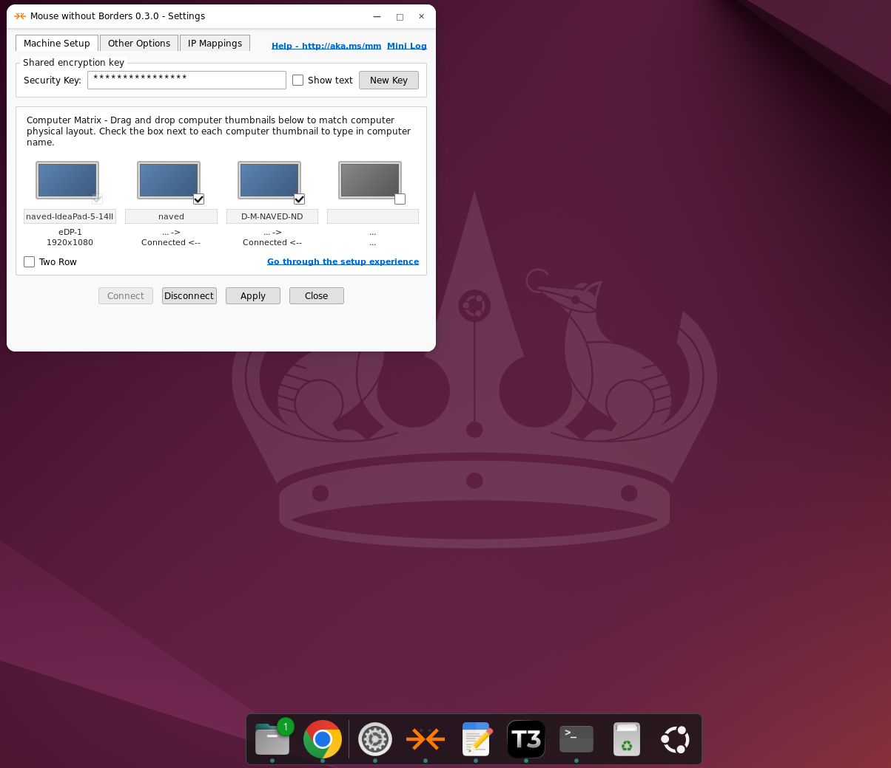

# Mouse Without Borders for Linux

An independent, full Linux implementation and adaptation of PowerToys Mouse
Without Borders. It is compatible with the Windows application and lets a
single mouse and keyboard move between Windows and Debian-based Linux PCs using
the familiar Mouse Without Borders GUI and connection workflow.

The application speaks the Windows program's native encrypted TCP protocol and
provides a GTK 4 rebuild of the classic settings form, a per-user background
service, rootless Wayland input through XDG Desktop Portal and EIS, text/PNG
clipboard sharing, screen-edge switching, management commands, and a Debian
package.

> [!IMPORTANT]
> This is an independent community project. It is not an official Microsoft or
> PowerToys release. Mouse Without Borders and PowerToys are Microsoft product
> names and are referenced only to describe compatibility.

**[Download the latest release](https://github.com/NaveDanan/Mouse-Without-Borders-for-Linux/releases/latest)**

## Screenshot



## Install

Download the latest `.deb` from the
[GitHub releases](https://github.com/NaveDanan/Mouse-Without-Borders-for-Linux/releases)
page, then run:

```sh
sudo apt install ./powertoys-mouse-without-borders_0.4.0_amd64.deb
powertoys-mouse-without-borders
```

## Build and test

Ubuntu 24.04 (amd64) is the reference platform.

Install the build and runtime dependencies:

```sh
sudo apt install build-essential cargo python3 python3-gi \
  gir1.2-gtk-4.0 gir1.2-adw-1 python3-cryptography xclip wl-clipboard \
  xdg-desktop-portal xdg-desktop-portal-gnome dbus-user-session xdotool
```

```sh
python3 -m unittest discover -s tests -v
cargo test --manifest-path portal-bridge/Cargo.toml --locked
cargo clippy --manifest-path portal-bridge/Cargo.toml --locked --all-targets -- -D warnings
./packaging/build-deb.sh
```

The package is written to `dist/`. Install a local build with:

```sh
sudo apt install ./dist/powertoys-mouse-without-borders_0.4.0_amd64.deb
powertoys-mouse-without-borders
```

The first launch opens the setup experience, which asks for the other
computer's name and its 16-character security key. GNOME then displays its
normal Input Capture and Remote Desktop permission dialogs. The compositor must
receive the first approval from the signed-in user; an application cannot grant
itself global input access. The background service retains that approved portal
session across Connect, Disconnect, Reconnect, and compatible settings changes,
so desktops with the InputCapture v1 portal do not ask on every PC connection.
A new login, service restart, or monitor-edge change may require approval again.
The service never reads `/dev/input`, writes `/dev/uinput`, or runs as root.

While the application is running, its Mouse Without Borders indicator remains
visible in Ubuntu's top bar. Closing the settings window with its **x** or
**Close** button hides the window without stopping sharing. Right-click the
indicator to open its **Open**, **Settings**, and **Exit** menu; only **Exit**
stops the background service and terminates the application. The indicator
uses Ubuntu's built-in StatusNotifierItem/AppIndicator integration and does not
load GTK 3 into the GTK 4 application.

On each launch, the application checks the latest stable GitHub release in the
background. Being up to date and temporary network failures are silent. The
**Check Updates** checkbox on the Other Options tab controls launch checks, and
**Refresh** performs an immediate manual check. When an update is available,
the dialog shows the installed and latest versions. **Download and Install**
downloads the matching Debian package, verifies its GitHub-published SHA-256
digest, and requests administrator authorization through the desktop's normal
PolicyKit prompt. Mouse Without Borders stays open throughout the download and
installation, then closes and relaunches itself only after the installed
package version has been verified.

## Settings form

The window mirrors the Windows form: Machine Setup, Other Options, and IP
Mappings tabs, the shared encryption key row, and the computer matrix.

The matrix is live rather than decorative. It always contains four computer
slots, like the Windows application. The local Linux computer is locked in one
slot; tick any of the other slots to add up to three Windows PCs, enter each
machine name, and drag the tiles to arrange how the pointer crosses between
them. `Two Row` changes the matrix between a 1x4 row and a 2x2 grid. `Wrap
Mouse` connects the two ends of a row.

Double-clicking a Windows tile takes over that computer and double-clicking the
local tile comes back. The service creates all required outer-edge portal
barriers in one approved capture session and routes each edge to the adjacent
computer. Physical Linux monitors are detected separately to ensure barriers
are placed only on the desktop's exterior boundary. Visible Connect and
Disconnect buttons control the background service, while right-clicking the
matrix also offers Connect, Disconnect, and Reconnect. Options with no Linux
equivalent yet (for example Disable CAD) are stored so the form round-trips,
and take effect as the matching feature lands.

Base TCP port and encryption compatibility live at the bottom of the IP
Mappings tab; the mapping table itself resolves a machine name to an address
before DNS is consulted.

The key is not accepted as a command-line argument. The UI or
`configure --secret-stdin` writes it to a mode-`0600` file under
`$XDG_CONFIG_HOME/powertoys-mwb-linux/`. Logs redact the configured key. The
Windows wire format uses AES-CBC but no message authentication, so use the tool
only on a trusted LAN or VPN.

## Commands

```sh
powertoys-mouse-without-borders status
powertoys-mouse-without-borders connect
powertoys-mouse-without-borders disconnect
powertoys-mouse-without-borders reconnect
powertoys-mouse-without-borders switch-machine 1
powertoys-mouse-without-borders switch-machine 2
powertoys-mouse-without-borders switch-machine 3
powertoys-mouse-without-borders switch-machine 4
powertoys-mouse-without-borders switch-host
powertoys-mouse-without-borders local
```

While input is captured, `Ctrl+Alt+Esc` is the emergency return shortcut.
GNOME 46 does not expose the Global Shortcuts portal, so the Keyboard Shortcuts
group on the Other Options tab writes per-user GNOME custom bindings instead,
preserving any bindings you already have. "Switch between machines" binds
`Ctrl+Alt+F1` through `F4` (or `Ctrl+Alt+1` through `4`) to the corresponding
matrix slots, and the letter selectors bind reconnect, show settings, and
exit. `Disable` removes the binding again. The same actions remain available
from the matrix and the CLI commands above.

Wayland portal access is intentionally unavailable at the login/lock screen or
in another user's session. Native X11 needs a future XInput/XTest backend;
XWayland cannot provide secure global Wayland input.

## Compatibility

Mouse Without Borders releases use four incompatible encryption profiles and do
not negotiate a version. Auto mode opens a fresh connection for each known
profile: the final standalone Microsoft Garage release with fixed salt/IV,
50,000 PBKDF2-SHA1 iterations, and SHA-256 packet magic; PowerToys stable with
fixed salt/IV and 50,000 PBKDF2-SHA512 iterations; transitional random salt/IV
with 50,000 iterations; and current random salt/IV with 100,000 iterations. The
UI reports Connected only after the peer returns the exact complemented
handshake challenge.

## License and attribution

Released under the [MIT License](LICENSE). This adaptation originated in the
[Microsoft PowerToys](https://github.com/microsoft/PowerToys) codebase; original
Microsoft copyright notices are retained. See [ATTRIBUTION.md](ATTRIBUTION.md)
and the third-party notices included in each Debian package.
